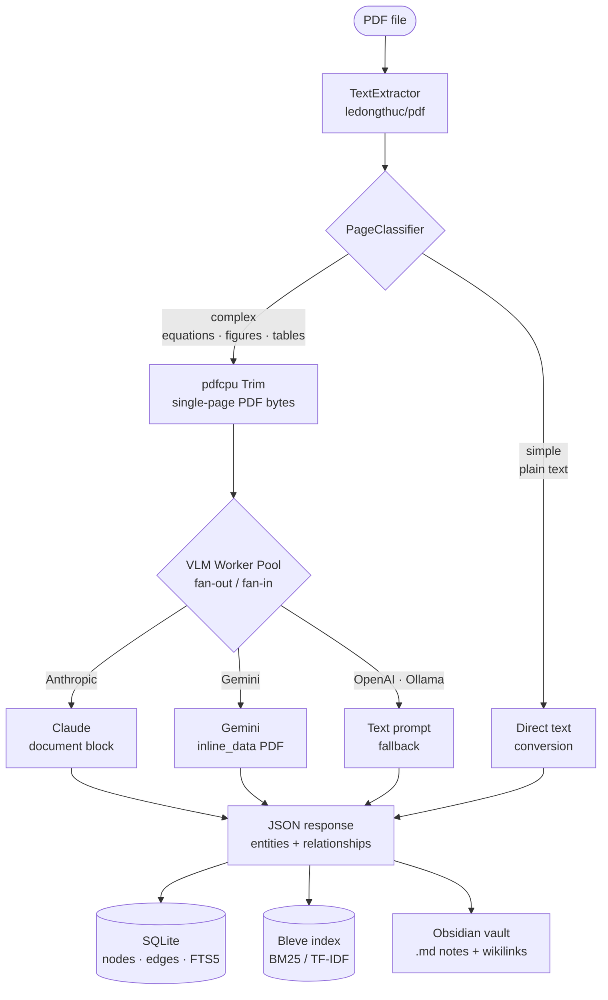
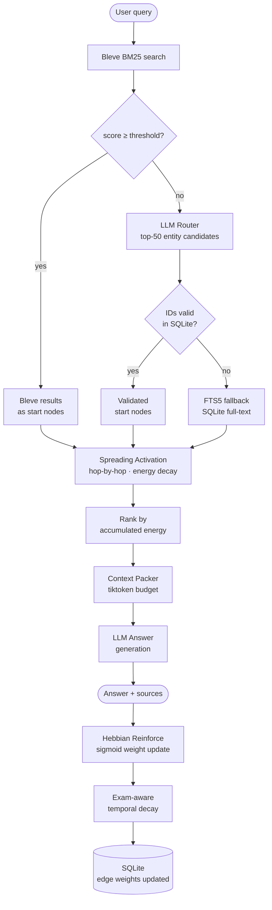

# BioGraph

A Go CLI tool that builds an associative knowledge graph from lecture PDFs, stored as an Obsidian vault, with spreading-activation retrieval and adaptive Hebbian learning.

## How it works

1. **Ingest** — PDFs are processed page-by-page in pure Go. Text-rich pages are extracted directly; pages with equations, figures, or tables are sent as raw PDF bytes to a vision model for structured extraction.
2. **Store** — Entities and relationships are stored in SQLite with FTS5 full-text search. Bleve provides BM25/TF-IDF ranking. Each entity also becomes an Obsidian markdown note.
3. **Ask** — A query is routed to starting nodes via Bleve (falls back to LLM router). Spreading activation traverses the graph outward, accumulating energy along weighted edges. The top-ranked nodes are packed into an LLM context window and answered.
4. **Learn** — Each query reinforces co-activated edges using a sigmoid-bounded Hebbian update. Weights decay at rates that depend on how far away the next exam is.

---

## Core technology

### Spreading activation

When you ask a question, BioGraph does not do a flat keyword search. It finds one or more starting nodes (via BM25 or an LLM router), then simulates energy flowing outward through the graph like a neural signal spreading through a brain.

Each hop multiplies the energy by the edge weight and a per-hop decay factor:

```
transfer = current_energy × edge_weight × decay_per_hop
```

Nodes reachable from *multiple* starting nodes accumulate energy from every path that reaches them. Those intersection nodes end up with the highest scores and appear first in the LLM context — because a concept that bridges several relevant starting points is likely what the question is actually about.

Paths below `min_energy` (default 0.05) are pruned immediately, so the traversal stays bounded even in a large graph.

---

### Sigmoid-bounded Hebbian learning

After every answered query, BioGraph reinforces the edges between co-activated nodes. The update rule is:

```
w_new = 1 / (1 + exp(-(w_old + α − c)))
```

where `α = 0.05` (reinforcement rate) and `c = 0.5` (sigmoid center). This is a **bounded Hebbian rule**: edges that fire together get stronger, but the sigmoid function prevents any weight from ever reaching 1.0 or 0.0.

#### How the sigmoid shapes learning

The key insight is that the formula maps `w_old` through a sigmoid whose inflection point sits at `c − α = 0.45`. This creates three distinct regimes:

| `w_old` range | Behaviour | Why |
|---------------|-----------|-----|
| Near 0 | Weight rises quickly toward ~0.39 | Sigmoid output is well above input in this region |
| ~0.5 | Small positive nudge (+0.012) | Near the inflection — change is fastest here |
| Near 1 | Weight pulled *back* toward ~0.61 | Sigmoid output is below input; acts as a ceiling |

The function has a stable **fixed point** at approximately `w ≈ 0.51`. No matter where a weight starts, repeated reinforcement pulls it toward this attractor — never to 1.0, never stuck at 0. This means:

- A new edge (weight 0.5 by default) gets a small boost each time it fires.
- A well-established edge cannot dominate; it stays bounded near 0.51.
- A dormant edge (low weight from decay) recovers slowly when reactivated.

#### Visualising the attractor

```
w_old   →   w_new    change
─────────────────────────────
0.00    →   0.39     +0.39   ↑ rapid recovery
0.10    →   0.45     +0.35   ↑
0.30    →   0.49     +0.19   ↑
0.50    →   0.51     +0.01   ↑ (barely above fixed point)
0.51    →   0.51      0.00   ← fixed point
0.60    →   0.54     −0.06   ↓ soft ceiling
0.80    →   0.57     −0.23   ↓
0.99    →   0.63     −0.36   ↓ strong pull-back
```

The slope is steepest near the fixed point, which means the rule is most sensitive to the difference between frequently-fired and rarely-fired edges precisely in the range that matters for ranking — neither brand-new nor burned-in.

---

### Exam-aware temporal decay

Edge weights decay between study sessions at a rate that depends on how close the next exam is:

| Days until exam | Decay factor | Effect per day |
|-----------------|-------------|---------------|
| > 30 | 0.999 | Slow long-term forgetting |
| 7 – 30 | 0.9999 | Near-zero decay during exam prep |
| 0 – 7 | 1.000 | Frozen — weights preserved exactly |
| −7 to 0 | 0.995 | Gentle post-exam cooldown |
| < −7 | 0.980 | Aggressive cleanup of stale material |

Decay is applied after every `ask` query. Because decay is multiplicative and bounded below at 0.01, no edge disappears entirely — but concepts from a finished course gradually fade unless revisited.

The combination of Hebbian reinforcement (pulls toward 0.51) and temporal decay (multiplies weight downward) means the steady-state weight of an edge reflects actual query frequency against the exam timeline, not just how many times it was originally ingested.

---

## Flow diagrams

### Ingest pipeline



---

### Query pipeline



---

## Prerequisites

### System tools

| Tool | Purpose | Install |
|------|---------|---------|
| Go 1.21+ | Build the CLI | [go.dev/dl](https://go.dev/dl/) |
| GCC / Xcode CLT | Required for `go-sqlite3` (CGo) | `xcode-select --install` |
| Ollama *(optional)* | Local LLM/VLM inference | `brew install ollama` |

No other system tools are required. PDF text extraction and page splitting are handled entirely by bundled Go libraries (`ledongthuc/pdf` + `pdfcpu`).

### LLM provider — pick one

| Provider | Required env var | Notes |
|----------|----------------|-------|
| Anthropic (default) | `ANTHROPIC_API_KEY` | Claude Haiku — fast and cheap; accepts PDF natively for VLM |
| Gemini | `GEMINI_API_KEY` | Gemini 2.0 Flash — also accepts PDF natively |
| OpenAI | `OPENAI_API_KEY` | GPT-4o-mini — text extraction used for VLM pages (no PDF input) |
| Ollama | *(none)* | Set `llm.provider: ollama`, run `ollama serve` first |

Export your key before running any command:

```bash
# Anthropic
export ANTHROPIC_API_KEY="sk-ant-..."

# or Gemini
export GEMINI_API_KEY="AIza..."
```

---

## Installation

```bash
# Clone / navigate to the project
cd /path/to/biograph

# Build the binary (CGo required for SQLite)
CGO_ENABLED=1 go build -o ./build/biograph ./cmd/biograph

# Optional: install system-wide
cp ./build/biograph /usr/local/bin/biograph
```

Or use Make:

```bash
make build
```

---

## Configuration

Copy and edit `biograph.yaml` in the project root (it is auto-loaded from the current directory):

```yaml
vault:
  path: "/Users/you/obsidian/BioGraph"   # ← point to your Obsidian vault folder
  entity_dir: "entities"
  source_dir: "sources"

database:
  path: "./biograph.db"

search:
  bleve_index_path: "./biograph.bleve"
  bleve_confidence_threshold: 0.5
  llm_fallback_enabled: true

activation:
  max_hops: 2
  min_energy: 0.05
  decay_per_hop: 0.7
  max_context_nodes: 20
  max_context_tokens: 6000

plasticity:
  reinforcement_alpha: 0.05
  sigmoid_center: 0.5
  decay_enabled: true
  decay_interval: "24h"

llm:
  # Providers: anthropic | gemini | openai | ollama
  provider: "anthropic"
  model: "claude-haiku-4-5-20251001"
  vlm_model: "claude-haiku-4-5-20251001"
  api_key_env: "ANTHROPIC_API_KEY"   # env var name for the API key
  max_retries: 3

  # Gemini example:
  # provider: "gemini"
  # model: "gemini-2.0-flash"
  # vlm_model: "gemini-2.0-flash"

ingestion:
  workers: 8          # concurrent VLM workers (default: num CPU)
  force_vlm: false    # true = send every page to VLM
```

**Minimum required change:** set `vault.path` to wherever your Obsidian vault lives (the directory must already exist).

---

## Usage

### Ingest a lecture PDF

```bash
biograph ingest lecture03.pdf --course deep_learning --exam-date 2026-06-15
```

Flags:

| Flag | Description |
|------|-------------|
| `--course` | Tag for the course (used for filtering and exam decay) |
| `--exam-date` | `YYYY-MM-DD` — drives the exam-aware weight decay schedule |
| `--force-vlm` | Skip the text-first pass, send every page to the VLM |
| `--workers N` | Number of concurrent VLM API calls (default: number of CPUs) |
| `--provider` | Override LLM provider for this run: `anthropic`, `openai`, `ollama` |

After ingestion, markdown notes appear in your Obsidian vault under `entities/` and `sources/`.

### Ask a question

```bash
biograph ask "How does backpropagation use the chain rule?"
```

```bash
# Limit to one course
biograph ask "Explain batch normalization" --course deep_learning

# Increase traversal depth for broader context
biograph ask "What connects attention mechanisms to transformers?" --hops 3
```

The answer includes source references (PDF name + page number).

### Search the graph

```bash
biograph search "gradient descent"

# Filter by course, limit results
biograph search "loss function" --course deep_learning --limit 5
```

### Graph status

```bash
biograph status
```

Shows total nodes, edges, courses, query count, top entities by activation weight, and upcoming exams.

---

## Obsidian setup

1. Open Obsidian and point it at the vault directory you set in `biograph.yaml`.
2. Install the **Dataview** plugin (Settings → Community plugins → Dataview).
3. Open `dashboards/exam_prep.md` to see a live table of your top concepts sorted by activation weight.
4. Use the Graph View (filtered by `#deep_learning` or similar) to explore entity relationships.

Entity notes are written automatically on every `ingest` run. Wikilinks in the "Connections" section populate the Obsidian graph view with zero extra work.

---

## Make targets

```bash
make build                                  # compile binary to ./build/biograph
make ingest PDF=lecture.pdf COURSE=ml       # ingest a PDF
make ingest PDF=lecture.pdf COURSE=ml EXAM=2026-06-15
make ask Q="What is the kernel trick?"     # ask a question
make search TERM="neural network"          # search
make status                                # show graph stats
make test                                  # run go test ./...
make clean                                 # remove build/, biograph.db, biograph.bleve
```

---

## Project structure

```
biograph/
├── cmd/biograph/main.go          — entry point
├── internal/
│   ├── cli/                      — Cobra commands (ingest, ask, search, status)
│   ├── config/config.go          — typed config with defaults
│   ├── storage/
│   │   ├── sqlite.go             — DB open, migrations, stats
│   │   ├── schema.go             — DDL: nodes, edges, FTS5 virtual table, sync triggers
│   │   ├── nodes.go              — Node upsert / get / FTS search
│   │   └── edges.go              — Edge upsert / Hebbian update / exam-aware decay
│   ├── ingestion/
│   │   ├── pipeline.go           — orchestrator: text → classify → VLM → store → index
│   │   ├── text_extractor.go     — pdftotext page-by-page extraction
│   │   ├── page_classifier.go    — heuristics: LaTeX / tables / image-heavy pages
│   │   ├── vlm_worker.go         — fan-out/fan-in VLM worker pool
│   │   └── markdown_writer.go    — writes Obsidian notes (YAML frontmatter + wikilinks)
│   ├── search/
│   │   ├── bleve_index.go        — Bleve BM25 index: build, query, score
│   │   └── router.go             — Bleve → LLM router → FTS5 fallback chain
│   ├── graph/
│   │   ├── activation.go         — spreading activation with concurrent traversal
│   │   ├── context_packer.go     — token-aware context assembly (tiktoken)
│   │   └── plasticity.go         — sigmoid Hebbian updates + exam-aware decay runner
│   └── llm/client.go             — Anthropic / OpenAI / Ollama HTTP client with retry
├── vault/
│   ├── dashboards/exam_prep.md   — Dataview dashboard (exam prep view)
│   └── templates/entity_template.md
├── biograph.yaml                 — configuration file
└── Makefile
```

---

## Troubleshooting

**`cgo: C compiler not found`**
Run `xcode-select --install` to install Apple's command-line tools (required for `go-sqlite3`).

**`pdftotext: command not found`**
Install poppler: `brew install poppler`. Then verify with `which pdftotext`.

**`env var ANTHROPIC_API_KEY not set`**
Export the key in your shell before running: `export ANTHROPIC_API_KEY="sk-ant-..."`.
You can also add it to `~/.zshrc` or `~/.zprofile` to make it permanent.

**Bleve index out of sync after manual DB edits**
Delete `./biograph.bleve` and re-ingest. The index is rebuilt automatically.

**Ollama: connection refused**
Start the Ollama daemon first: `ollama serve`. Then pull a model: `ollama pull llama3`.

**Gemini: 400 / model not found**
Check `GEMINI_API_KEY` is set and `llm.model` matches an available Gemini model name (e.g. `gemini-2.0-flash`, `gemini-1.5-pro`).
