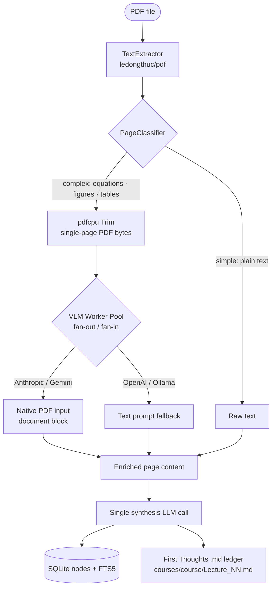
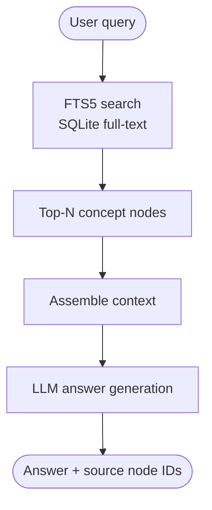
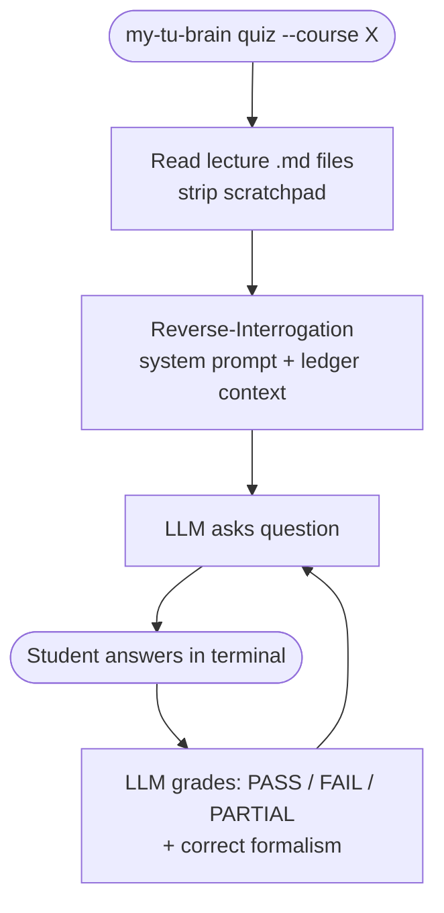

# My TU Brain

A Go CLI study copilot that ingests lecture PDFs, generates structured "First Thoughts" study ledgers, and lets you ask questions or run interactive exam sessions — all from your terminal.

Built for the rigours of an AI/ML Master's program where a single high-stakes written exam determines the grade.

---

## How it works

1. **Ingest** — Drop a PDF. My TU Brain extracts text page-by-page. Complex pages (equations, figures, tables) are sent as raw PDF bytes to a vision model. All extracted content is then fed into **one synthesis call** that returns:
   - Atomic concept nodes → stored in SQLite + FTS5 (powers `ask`)
   - A structured "First Thoughts" markdown ledger → written to `courses/<course>/`

2. **Ask** — FTS5 retrieves the most relevant concept nodes, assembles them as context, and calls the LLM for a precise academic answer.

3. **Quiz** — The LLM reads your lecture ledgers and interrogates you as a TU Darmstadt examiner: warm-up → mathematical rigour → boundary testing. One question at a time, graded PASS/FAIL/PARTIAL.

---

## The First Thoughts ledger

Every ingested PDF produces one markdown file:

```markdown
# Lecture 01: Introduction to Deep Learning

## 1. Executive Intuition
...

## 2. Core Theoretical Concepts
- **Formal Definition:** ...
- **Mechanism:** ...
- **Assumptions/Constraints:** ...

## 3. Mathematical Foundations
$$ \nabla_\theta \mathcal{L} = ... $$

## 4. 📝 Exam Review (High-Yield Extraction)
- Computational complexities
- Comparative analysis (Method A vs B)
- Known failure modes

## 5. Student Scratchpad & Inquiries

<!-- my-tu-brain:scratchpad -->

> Your personal notes go here.
```

On re-ingest (e.g. updated slides), the LLM section is regenerated but **everything you wrote below `<!-- my-tu-brain:scratchpad -->`** is preserved exactly.

---

## Flow diagrams

### Ingest pipeline



### Query pipeline



### Quiz session



---

## Prerequisites

| Tool | Purpose | Install |
|------|---------|---------|
| Go 1.21+ | Build the CLI | [go.dev/dl](https://go.dev/dl/) |
| GCC / Xcode CLT | Required for `go-sqlite3` (CGo) | `xcode-select --install` |
| Ollama *(optional)* | Local LLM inference | `brew install ollama` |

No external system binaries required. PDF processing is entirely in-process via `ledongthuc/pdf` and `pdfcpu`.

### LLM provider — pick one

| Provider | Env var | PDF input |
|----------|---------|-----------|
| Anthropic (default) | `ANTHROPIC_API_KEY` | Native (document block) |
| Gemini | `GEMINI_API_KEY` | Native (inline_data) |
| OpenAI | `OPENAI_API_KEY` | Falls back to text |
| Ollama | *(none)* | Falls back to text |

```bash
export ANTHROPIC_API_KEY="sk-ant-..."
# or
export GEMINI_API_KEY="AIza..."
```

---

## Installation

```bash
CGO_ENABLED=1 go build -o ./build/my-tu-brain ./cmd/my-tu-brain
# or
make build
```

---

## Configuration

`my-tu-brain.yaml` is loaded from the current directory (or `--config` flag):

```yaml
output:
  content_dir: "./courses"   # where First Thoughts ledgers are written

database:
  path: "./my-tu-brain.db"

llm:
  provider: "anthropic"                  # anthropic | gemini | openai | ollama
  model: "claude-haiku-4-5-20251001"
  api_key_env: "ANTHROPIC_API_KEY"
  max_retries: 3

  # Gemini example:
  # provider: "gemini"
  # model: "gemini-2.0-flash"

ingestion:
  workers: 8     # concurrent VLM workers (default: num CPU)
```

All fields have defaults — only set what you need to change.

---

## Usage

### Ingest a lecture PDF

```bash
my-tu-brain ingest lecture03.pdf --course deep_learning --exam-date 2026-06-15
```

| Flag | Description |
|------|-------------|
| `--course` | Course tag — determines output subdirectory |
| `--exam-date` | `YYYY-MM-DD` — embedded in the ledger frontmatter |
| `--workers N` | Concurrent VLM API calls (default: number of CPUs) |
| `--provider` | Override provider for this run |

Output: `courses/deep_learning/lecture03.md`

### Ask a question

```bash
my-tu-brain ask "How does backpropagation use the chain rule?"
my-tu-brain ask "Explain batch normalization" --course deep_learning
my-tu-brain ask "What is the vanishing gradient problem?" --limit 15
```

### Quiz yourself

```bash
# Quiz on all lectures in a course
my-tu-brain quiz --course deep_learning

# Quiz on a specific lecture
my-tu-brain quiz --course deep_learning --lecture "Lecture_03"
```

The LLM acts as a TU Darmstadt examiner. Questions escalate from conceptual warm-up to full mathematical derivations. Type `q` or `quit` to end the session.

### Search concepts

```bash
my-tu-brain search "gradient descent"
my-tu-brain search "loss function" --course deep_learning --limit 5
```

### Status

```bash
my-tu-brain status
```

---

## Output structure

```
courses/
├── deep_learning/
│   ├── Lecture_01_Intro.md
│   ├── Lecture_02_Backprop.md
│   └── ...
└── probabilistic_models/
    └── Lecture_01_Foundations.md

my-tu-brain.db       — SQLite: concept nodes + FTS5 index (powers ask/search)
```

Edit your notes freely inside the scratchpad section. They survive re-ingestion.

---

## Make targets

```bash
make build
make ingest PDF=lecture.pdf COURSE=deep_learning
make ingest PDF=lecture.pdf COURSE=deep_learning EXAM=2026-06-15
make ask Q="What is the kernel trick?"
make search TERM="neural network"
make status
make test
make clean
```

---

## Project structure

```
my-tu-brain/
├── cmd/my-tu-brain/main.go
├── internal/
│   ├── cli/
│   │   ├── root.go         — Cobra root, config init, logger
│   │   ├── ingest.go       — my-tu-brain ingest
│   │   ├── ask.go          — my-tu-brain ask
│   │   ├── search.go       — my-tu-brain search
│   │   ├── status.go       — my-tu-brain status
│   │   └── quiz.go         — my-tu-brain quiz (interactive multi-turn)
│   ├── config/config.go    — typed config with defaults
│   ├── storage/
│   │   ├── sqlite.go       — DB open, migrations, stats, query log
│   │   ├── schema.go       — DDL: nodes, FTS5 virtual table, sync triggers
│   │   └── nodes.go        — Node upsert / get / FTS search
│   ├── ingestion/
│   │   ├── pipeline.go     — orchestrator: extract → classify → VLM → synthesise → write
│   │   ├── text_extractor.go
│   │   ├── page_classifier.go
│   │   ├── vlm_worker.go   — fan-out/fan-in VLM pool (per-page enrichment)
│   │   └── markdown_writer.go — First Thoughts writer with scratchpad protection
│   ├── search/fts.go       — FTS5 search wrapper
│   └── llm/client.go       — Anthropic / Gemini / OpenAI / Ollama client
│                              Synthesize() · Answer() · Chat() · ExtractPage()
├── my-tu-brain.yaml
└── Makefile
```

---

## Troubleshooting

**`cgo: C compiler not found`**
Run `xcode-select --install` (macOS) to install the command-line tools required by `go-sqlite3`.

**`env var ANTHROPIC_API_KEY not set`**
Export the key before running: `export ANTHROPIC_API_KEY="sk-ant-..."`. Add to `~/.zshrc` to make it permanent.

**Ollama: connection refused**
Start the daemon first: `ollama serve`. Pull a model: `ollama pull llama3`.

**Gemini: 400 / model not found**
Verify `GEMINI_API_KEY` is set and `llm.model` is a valid Gemini model (e.g. `gemini-2.0-flash`).

**Re-ingest overwrote my notes**
It shouldn't — the scratchpad delimiter `<!-- my-tu-brain:scratchpad -->` protects everything below it. If the delimiter is missing from your file, add it manually and re-ingest.
